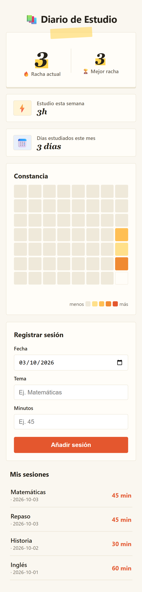

<div align="center">

# 📚 Study Diary


[](https://github.com/CarlosArman/MyStudyDiary/actions/workflows/tests.yml)
[](https://carlosarman.github.io/MyStudyDiary/)

<br>

**[▶ Open live app →](https://carlosarman.github.io/MyStudyDiary/)**

🌐 **Language / Idioma**

🇬🇧 English &nbsp;|&nbsp; [🇪🇸 Español](README.es.md)

A static web app to log study sessions and stay motivated by tracking your streak of consecutive study days.

Practice project built while following the free course **[Curso de Desarrollo con IA: el Nuevo Programador](https://mouredev.com)** by [Brais Moure](https://github.com/mouredev).

Built entirely with **[OpenCode](https://opencode.ai)** using AI agents — no code was written by hand.



</div>

---

## 🎯 Why This Project Matters

This repository is designed as a **front-end portfolio project** that demonstrates more than a simple to-do app. It highlights how to build a browser-only web app with no frameworks, no build tools, and no server — just clean, readable code.

It demonstrates practical front-end concepts such as:

- **Local date handling** — avoiding the classic UTC offset bug with `toISOString()` and `new Date("YYYY-MM-DD")`
- **Streak logic** — calculating consecutive study days correctly, even across week/month boundaries
- **Data persistence** — using `localStorage` with separate keys to protect existing user data
- **Responsive design** — mobile-first layout tested down to 320 px with a "study notebook" visual language
- **SDD workflow** (Spec-Driven Development) — every feature goes through spec → plan → tasks → implementation → tests before touching code
- **Pure-logic unit tests** — 59 test cases with `node --test`, no external dependencies

---

## ✨ Features

| Feature | Description |
|---|---|
| 🔥 Current streak | Consecutive days studied up to today |
| 🏆 Best streak | All-time record of consecutive days |
| ⚡ This week | Minutes accumulated from Monday to today |
| 🎯 Weekly goal | Minute-based target with progress bar and status (behind / reached / exceeded) |
| 📅 Days this month | Unique days with at least one session in the current month |
| 🗓️ Heat map | Last 8 weeks with 5 activity levels (like GitHub Contributions) |
| 📝 Log session | Form to add a date, topic and duration in minutes |
| 📋 History | All sessions listed from most to least recent |

---

## 🚀 How to run it

No installation or server needed. Just download the repository and open `index.html` with a double-click in your browser.

```
MyStudyDiary/
├── index.html    ← open this file
├── styles.css
└── app.js
```

---

## 🛠️ Tech stack

- **Pure HTML, CSS and JavaScript** — no frameworks, no npm, no build step.
- **localStorage** to persist sessions and the weekly goal between visits.
- Works from `file://` with a double-click; no server required.
- **Responsive** design — tested down to 320 px.

---

## 📦 Project structure

```
MyStudyDiary/
├── index.html              # Page structure
├── styles.css              # Styles ("study notebook" colour palette)
├── app.js                  # All logic and rendering
├── docs/
│   └── constitution.md     # Design principles and technical rules
├── specs/
│   ├── 001-heat-map/       # Heat map feature spec
│   └── 002-objetivo-semanal/  # Weekly goal feature spec
└── test/
    └── test-objetivo.js    # Pure-logic tests (node --test)
```

---

## 🧪 Tests & CI

Tests cover the pure logic of the weekly goal (59 cases). No external dependencies required:

```bash
node --test test/test-objetivo.js
```

A **GitHub Actions** workflow (`.github/workflows/tests.yml`) runs these tests automatically on every push to `main` and on every pull request. The badge at the top of this README reflects the current test status in real time.

---

## 📐 Key technical decisions

- **Always use local dates**: never `toISOString()` or `new Date("YYYY-MM-DD")` to avoid UTC offset bugs.
- **Correct streak logic**: consecutive days ending today; if there is no session today but there was yesterday, the streak stays alive.
- **Goal status based on exact minutes**, not on the rounded percentage (299 min with goal 300 → not reached, even if the visual percentage shows 100 %).
- **Separate localStorage keys**: sessions (`diario-estudio-sesiones`) and goal (`diario-estudio-objetivo`) are stored independently to avoid data mixing and protect existing records.

---

## 🎓 About the course

This project is part of [Brais Moure](https://github.com/mouredev)'s free course on AI-assisted programming. Workshop videos where this project was built:

| # | Title | Link |
|---|---|---|
| 1 | Workshop — Part 1 | [▶ YouTube](https://www.youtube.com/watch?v=qHYi92zRn-s&t=41s) |
| 2 | Workshop — Part 2 | [▶ YouTube](https://www.youtube.com/watch?v=hzQNE092cW0) |
| 3 | Workshop — Live session | [▶ YouTube](https://www.youtube.com/live/R1UGk4rb9BM) |

---

## 📄 License

Educational project — free to use.
